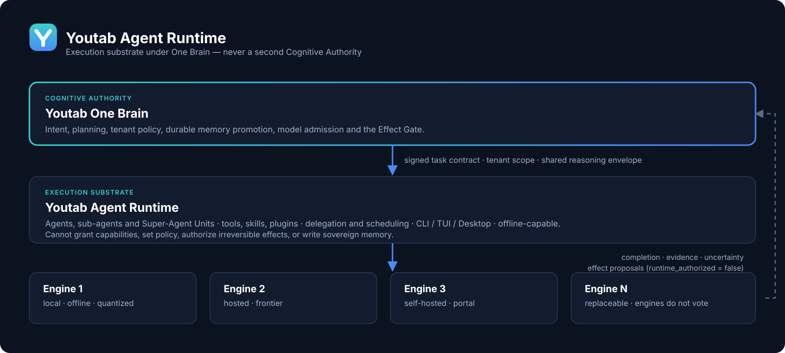

<div align="center">
  
</div>

<div align="center">
  <a href="https://youtab-agent-runtime.youtab.io/docs/"></a>
  <a href="https://github.com/eimanghazaei/Youtab-Agent-Runtime/discussions"></a>
  <a href="https://github.com/eimanghazaei/Youtab-Agent-Runtime/blob/main/LICENSE"></a>
  <a href="https://youtab.io"></a>
  <a href="README.zh-CN.md"></a>
  <a href="README.ur-pk.md"></a>
  <a href="README.es.md"></a>
</div>

# Youtab Agent Runtime

Youtab Agent Runtime is the portable execution layer for Youtab agents and
Super-Agent Units. It supplies model-neutral reasoning loops, tools, skills,
plugins, delegation, scheduling, messaging adapters, CLI/TUI/Desktop surfaces,
and offline-capable execution without becoming a second Cognitive Authority.

## Architectural position

Youtab uses one sovereign Brain and multiple replaceable Engines. This runtime
executes Brain-issued task contracts; it does not own final cognitive authority,
durable memory policy, tenant policy, effect authorization, model admission, or
verified knowledge promotion.

<div align="center">
  
</div>

The managed-runtime boundary follows these invariants:

- One Brain; no agent, model, verifier, workflow or coalition becomes authority.
- Agents may be powerful and may create sub-agents only inside a signed task
  contract, shared reasoning envelope, tenant scope, trace and stop policy.
- Runtime memory access is mediated; the runtime cannot promote knowledge or
  write sovereign long-term memory directly.
- External effects remain subject to the Youtab Effect Gate.
- Intelligence escalation is not authority escalation.
- Completion reports include evidence, uncertainty, unresolved items and
  deactivation state.

## Product identity

The public and runtime identity is Youtab throughout:

- Python distribution: `youtab-agent-runtime`
- CLI: `youtab`
- managed worker: `youtab-agent-worker`
- configuration root: `~/.youtab-agent-runtime`
- environment prefix: `YOUTAB_AGENT_`
- Desktop product: `Youtab`

Third-party legal notices are isolated in `THIRD_PARTY_NOTICES.md`; original
upstream names are forbidden everywhere else by the branding gate.

## Local development

Python 3.11–3.13 and Node.js 20+ are supported.

```bash
python -m venv .venv
. .venv/bin/activate
python -m pip install -e '.[dev]'
scripts/run_tests.sh
```

On Windows, use the maintained PowerShell installer:

```powershell
.\scripts\install.ps1
```

The JavaScript workspaces use the root lockfile:

```bash
npm ci
npm run check
```

## Validation gates

The release candidate must pass all of the following without a fake-green or
suppressed finding:

- Python and JavaScript unit suites
- integration and managed-boundary contract tests
- CLI/TUI/Desktop E2E tests
- deterministic smoke tests
- OWASP Web/API and OWASP LLM disposition suites
- SAST and lint
- secret scanning
- dependency vulnerability and lock-integrity checks
- branding leakage and binary OCR checks

Run the Youtab aggregate gate:

```bash
scripts/youtab/run_all_gates.sh
```

## Supply-chain intake

Upstream candidates never merge automatically into this product history. The
intake process materializes a candidate outside the product repository, records
an immutable source digest, applies the Youtab transformation and patch registry,
then runs the full gate set. Promotion requires a reviewed Youtab PR and explicit
owner/release approval.

## Release boundary

This repository does not authorize a merge, deployment, VPS mutation, credential
change or Production admission. Those actions require a separate exact owner
authorization after evidence review.

## License

Youtab-owned changes are provided under the MIT license in `LICENSE`.
Third-party license and provenance obligations are retained in
`THIRD_PARTY_NOTICES.md`.
