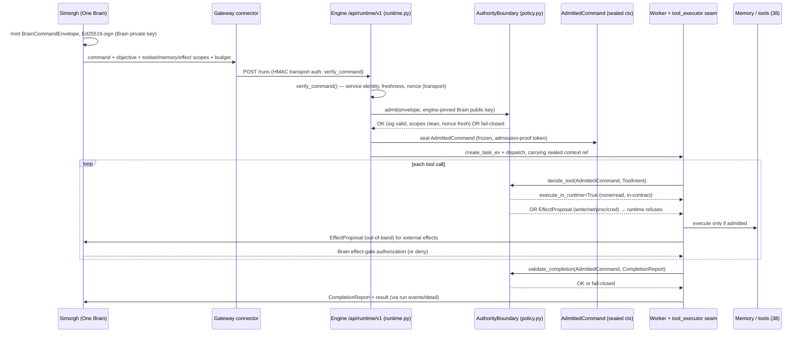

# ADR-0002 — Simorgh admission-to-execution contract (One Brain command authority)

**Status:** Accepted (2026-09-07) — superseded open decisions recorded below
**Scope:** Youtab-Agent-Runtime — the command-authority path from One Brain (Simorgh) to real tool/memory execution
**Supersedes:** nothing · **Related:** `ADR-0001-authentication-and-trust-boundary.md`, `YOUTAB_AGENT_RUNTIME_BOUNDARY.md`, `AGENT_RUNTIME_CONNECTOR_CONTRACT.md` (DRAFT / Not Canon)

> This ADR reconciles confirmed audit findings **#5, #6, #7**. It designs the canonical path and the enforced contract, and is now **Accepted** with the Owner's binding architecture decisions recorded in *Final Owner decisions* below. Implementation proceeds in the WAVE-30H remediation wave on coordinated Draft PR branches only. No canary, benchmark, merge, or deploy is authorized by this document.

---

## Final Owner decisions (binding — 2026-09-07 authorization)

These resolve every entry in *Owner decisions required* at the end of this ADR. Where they differ from an earlier *Recommendation*, **the decision below governs.**

1. **DP1 — composition & mandatoriness: DECIDED.** The two layers **compose**, and for **managed** execution **both are mandatory**:
   - **HMAC transport authentication** authenticates the AI OS connector/service; binds protocol version, method, path, body digest, correlation ID and transport principal; and provides durable atomic transport replay protection. **HMAC is not an execution-authority substitute.**
   - **Ed25519 Simorgh execution grant** is the **canonical source of execution authority**, minted only by the trusted Simorgh authority. It is **mandatory for managed `create_run`** and must remain bound through retry, tool calls, memory, artifacts, delegation, cancellation and completion.
   - Agent Runtime must **never create, widen, replace or infer** missing authority. An engine with no grant on a managed path fails closed.
   - This supersedes the ADR body's "Option B (optional-then-mandatory)" *as the end state*: the fail-closed flag (`YOUTAB_AGENT_REQUIRE_BRAIN_ENVELOPE`) remains only as the **staged-rollout mechanism** to reach the mandatory managed state on coordinated SHAs, not as a permanent optional mode.

2. **Standalone execution — DECIDED.** The local CLI is retained but exposed as an **explicit trust mode** named `local-standalone`. It **must not** claim to be Simorgh-managed, **must not** accept managed credentials/grants implicitly, and has **separately documented** authority, storage and security boundaries. The managed grant path and the standalone path are mutually exclusive and mode-gated.

3. **Simorgh signer readiness — DECIDED to proceed in-wave.** One Brain (Simorgh) **will** mint and Ed25519-sign the execution grant and consume `EffectProposal`/`CompletionReport`. This work is **in scope** and lands on a **coordinated AI OS Draft PR branch** (AI OS baseline `3c4bcb4f`) paired with this repo's Runtime Draft PR. The former "gating external dependency" is now a coordinated cross-repo deliverable, not a blocker.

4. **Grant field set — EXPANDED (binding).** The execution grant binds, at minimum: `protocol_version`, `tenant`, `workspace`, `user`, `membership_generation`, `authorization_version`/`epoch`, `command`, `attempt`, `root_run`, `agent`, `engine`, `tools`/`resources` scope, `memory`/`artifact` scope, `shared_budget`, `deadline`, `nonce`, `audience`, and `key_id`. This is a superset of today's `BrainCommandEnvelope`; the canonical schema is specified in `docs/architecture/CANONICAL-SIGNATURE-GRANT.md` (R1) and implemented as a versioned shared spec used by **both** repos.

5. **DP4 — Effect Gate transport: Option 4b** (proposal-as-continuation over the existing event cursor) for stage 1, per the ADR recommendation.

6. **DP6 — key custody:** engine reads Brain public keys from configuration / mounted key file (`YOUTAB_BRAIN_PUBLIC_KEYS`, `key_id`→b64); rotation via overlapping `key_id`s; signing material and authority state stay **outside** the untrusted Agent/tool process or behind authenticated IPC.

7. **Budget: one execution-tree budget (R5).** The `shared_budget` bound in the grant is a **durable, shared** budget across the root run + retries + all delegated agents + descendants + tools/effects. Delegation **inherits the remaining root budget** and never receives a fresh unlimited budget. Enforcement is unconditional for managed runs — it must **not** depend on benchmark campaign environment variables.

8. **Governance:** status transitions to **Accepted**; the mandatory-managed flip (stage 3) is executed on coordinated Draft PR SHAs under the governed WP model. No merge/deploy/canary/benchmark.

9. **Extensible tool registry — NO fixed tool-count cap (binding, 2026-09-07).** 38, 61 and 69 are historical/current *snapshots*, never an architectural ceiling. Agent Runtime MUST support an open-ended, extensible tool ecosystem (built-in, signed plugins, MCP, device-local, org-managed, Agent-specific, customer-authorized) addable via versioned registries/adapters **without editing a central hard-coded core list**. The fixed **"38/0/0" acceptance rule is replaced** by the invariant *every registered + enabled + authorized + operationally-available tool is discoverable, selectable and callable*, measured as: **unexpected-missing = 0, undocumented-hidden = 0, unauthorized-callable = 0, unavailable-falsely-advertised-as-callable = 0** — with exact counts recorded only as evidence snapshots. The **signed Simorgh grant defines the maximum authorized capability envelope**; the Runtime MAY narrow the *initially loaded* set for relevance/efficiency but MUST NOT expand beyond the grant, silently eliminate access within it, invent authority, let prompt/args alter authority, or lose grant/budget/tenant/context lineage during discovery or delegation. A **capability-preserving hybrid** is mandated (and supersedes the blanket rejection of schema deferral): always expose a compact, truthful index of ALL authorized+operational capabilities; directly load full schemas for tools selected as relevant; provide **deterministic same-run discovery + schema loading** for every other authorized tool so none is ever unreachable merely for not being selected first; record every selection/omission/expansion/invocation in a redaction-safe per-run provenance manifest. The canonical registry architecture, per-tool metadata contract, capability index, Simorgh-aware selection boundary, provenance manifest and acceptance tests (including a synthetic `computer_use`-class tool that registers→selects→discovers→invokes with **no change to core routing code**) are specified in **`ADR-0003-extensible-tool-registry.md`**. The `defer_core` mechanism, if used at all, must satisfy this capability-preserving invariant (truthful index + same-run discovery), which is the opposite of the capability-reducing behaviour rejected in WAVE-30E.

---

## Context

### The intended boundary

Youtab has one cognitive authority, **One Brain (Simorgh)**, and N interchangeable execution **engines** (`YOUTAB_AGENT_RUNTIME_BOUNDARY.md`). An engine is an execution plane, never a second brain, policy sovereign, memory authority, or effect authorizer. Every managed task is meant to enter through a signed `youtab.agent-command.v1` envelope that binds tenant, user, objective, the allowed toolsets/memory scopes/effect-proposal scopes, and a shared reasoning budget; effects that touch the outside world (write/network/process/credential/memory-write) are never self-authorized and instead return to the Brain as `youtab.effect-proposal.v1` records; every task-scoped agent returns a `youtab.agent-completion.v1` record.

That contract exists in code as data types and a policy object:

- `youtab_runtime/contracts.py`
  - `BrainCommandEnvelope` (`contracts.py:37-110`), frozen/`extra="forbid"`, Ed25519 `verify()` at `contracts.py:97-110`, canonical payload at `:88-95`.
  - `ReasoningEnvelope` shared budget (`contracts.py:18-34`).
  - `EffectProposal` with `runtime_authorized: Literal[False]` (`contracts.py:113-128`).
  - `CompletionReport` (`contracts.py:131-165`).
- `youtab_runtime/policy.py` — `AuthorityBoundary`
  - `admit()` verifies signature, forbids authority-bearing toolsets/sovereign memory scopes, checks the replay nonce (`policy.py:55-74`).
  - `decide_tool()` maps a `ToolIntent` to execute-in-runtime vs. an `EffectProposal` (`policy.py:76-108`).
  - `validate_completion()` enforces task/tenant coherence and deactivation (`policy.py:110-117`).

### The reality today — three confirmed gaps

The Brain contract is **architecturally disconnected from execution**. It is a validated island.

- **Finding #6 (disconnected):** the only non-test caller of `AuthorityBoundary`/`BrainCommandEnvelope` is `youtab_runtime/worker.py`, a stdin/stdout admission worker that verifies an envelope and then **dead-ends at `{"accepted": true}`** (`worker.py:31-45`) — it "exposes no public listener" and dispatches nothing into kanban. The DRAFT connector contract already acknowledges this in its own evidence section (`AGENT_RUNTIME_CONNECTOR_CONTRACT.md:13-34`: "signed-command boundary is not wired to execution … dead-ends at `{accepted:true}`").

- **The live path uses a *different* auth layer.** Real runs are created by `youtab_agent_cli/web_routers/runtime.py::runtime_create_run` (`runtime.py:1388`), which dispatches into the real engine via `kb.create_task_ex(...)` (`runtime.py:1551`) + `_dispatch_tick()` (`runtime.py:1611`). Its authorization is `_verify_signed_command` (`runtime.py:348`) → `runtime_command_auth.verify_command` (`runtime_command_auth.py:194`): an **HMAC-SHA256 shared-secret** signature over `(method, path, tenant, user, timestamp, nonce, body_hash, correlation)` (`runtime_command_auth.py:156-184`), with an SQLite nonce store (`runtime_command_auth.py:114-153`). `AuthorityBoundary` is **never invoked on this path**. The `BrainCommandEnvelope` never appears in the create-run body.

- **Finding #5 (unbound authorization):** `AuthorityBoundary.decide_tool()` authorizes a tool from `envelope.allowed_toolsets` **without re-verifying the envelope and with no proof the envelope was ever `admit()`-ed** (`policy.py:76-108`). It will return `execute_in_runtime=True` for an envelope with a bogus signature that never passed `admit()`. `decide_tool` has **zero non-test callers**.

- **Finding #7 (no proven chain):** there is no end-to-end path Simorgh → authenticated admission → agent/tool/memory execution → verified completion → result-to-Simorgh. `decide_tool` and `validate_completion` have no non-test callers; the real tool-dispatch chokepoint (`agent/tool_executor.py::_run_agent_tool_execution_middleware` → `_authorized_dispatch` → `execute(final_args)` at `tool_executor.py:384-482`) knows nothing about `BrainCommandEnvelope`; no integrated test exercises the whole chain.

### Constraints this design must preserve

One Brain + N engines; **all 38 tools stay directly visible** (no hiding/deferral/progressive-disclosure/removal); memory/skills/reasoning fully preserved; tenant isolation at every boundary (envelope binds `tenant_id`/`user_id`); engine/provider neutrality; fail-closed everywhere; nothing weakened to make this work.

### Assumptions (state and challenge if wrong)

1. Simorgh (the gateway / One Brain control plane) can be extended to **mint and Ed25519-sign** a `BrainCommandEnvelope`, and to **receive** `EffectProposal` and `CompletionReport` round-trips. If Simorgh cannot sign today, that is exactly the Owner-gated sequencing decision in §"Owner decisions required".
2. The 38 tools can be partitioned into named **toolsets** and assigned an **effect class** (`EffectClass` in `policy.py:14-22`) without changing tool behaviour — a metadata mapping, not a code rewrite of tools.
3. The kanban run store (`kanban_db`) remains the single authoritative run store; this ADR adds an authority envelope alongside a run, it does not add a second run state machine.
4. One engine process serves one tenant/user context per run (the worker is spawned per task); cross-run in-process sharing of the execution context is not required.

---

## Decision

Adopt the canonical path below and make it the **enforced** contract, replacing today's validated-but-disconnected island. The change is **additive and staged**; the envelope becomes mandatory only at a defined stage (see Rollout and the Owner decision on sequencing).

```
Simorgh (One Brain)
  → authenticated admission (transport auth + command-authority admission)
    → IMMUTABLE execution context (sealed AdmittedCommand)
      → Agent / tool / memory execution (every tool decision gated by the context)
        → verified completion (validate_completion)
          → result returned to Simorgh (+ EffectProposals for external effects)
```



The rest of this section resolves each required decision point.

### DP1 — Relationship between the two auth layers  *(Owner decision — the crux)*

There are two distinct trust facts, and they answer different questions:

| Layer | File | Proves | Key model |
|---|---|---|---|
| **HMAC signed-command** | `runtime_command_auth.py` | *This HTTP request came from the trusted gateway service, is fresh, is not replayed, was not tampered, and is bound to this tenant/user.* Transport/channel + request integrity. | Symmetric shared secret (`YOUTAB_AGENT_RUNTIME_SERVICE_SECRET`). |
| **Ed25519 BrainCommandEnvelope** | `contracts.py` + `policy.py` | *One Brain authorized THIS objective, with THIS toolset/memory/effect contract and THIS reasoning budget, for this tenant/user.* Command authority. | Asymmetric; engine holds only the Brain **public** key. It cannot forge a command even if fully compromised. |

**Recommendation: they COMPOSE as two layers; neither subsumes the other.** HMAC is the outer *channel/transport* gate (who is calling, is the request fresh and intact); the Ed25519 envelope is the inner *authority* payload carried in the create-run body and is what seeds the immutable execution context. This preserves the strong property that the engine cannot mint its own authority (public-key-only), while keeping the cheap, provider-neutral, symmetric transport gate that already works on non-loopback binds.

**Why not collapse to one:**
- *HMAC only* (drop the envelope): the engine and gateway share a symmetric secret, so a compromised engine can forge any "authorized" command — the whole One-Brain-is-sovereign property is lost. Rejected on the security constraint.
- *Ed25519 only* (drop HMAC): loses transport freshness/replay/tenant-binding at the HTTP edge and forces every read endpoint to carry a signed envelope. Over-couples authority to transport. Rejected.

**The Owner decision is sequencing/mandatoriness, not composition:**
- **Option A — envelope mandatory on `create_run` from stage 1.** Strongest, but hard-breaks the current gateway, which does not mint envelopes today (create-run body is `{agent, task, engine, …}`, `runtime.py:1388-1470`).
- **Option B (recommended) — envelope optional-then-mandatory, gated by a fail-closed engine flag.** Land the envelope path additively; while `YOUTAB_AGENT_REQUIRE_BRAIN_ENVELOPE` is off, create-run without an envelope behaves as today (HMAC only) **but tools that require a proven admission context are refused at dispatch** (see DP3). When the flag is on, an envelope-less create-run is refused 403. This makes the secure state reachable without a flag-day and gives a rollback path.

This flag flip is the single biggest Owner decision because it changes the gateway↔engine contract and requires Simorgh to be a signer.

### DP2 — The immutable execution context (makes finding #5 structurally impossible)

Introduce a sealed, in-process value — call it **`AdmittedCommand`** — that can be constructed **only** by the admission path, never by a tool or an agent:

- `runtime_create_run` (`runtime.py:1388`) parses the `BrainCommandEnvelope` from the body and calls `AuthorityBoundary.admit(envelope, brain_public_key)` (`policy.py:55`). Only on success does it construct `AdmittedCommand(envelope=<frozen>, admitted_at=…, admission_proof=<token>)`.
- `AdmittedCommand` is **frozen** (mirroring `BrainCommandEnvelope`'s `frozen=True`, `contracts.py:40`) and carries an **admission-proof token** that only `admit()` can produce (e.g. a keyed hash over the envelope canonical payload + an admission secret, or simply a private constructor guarded by a module-level factory). A tool cannot fabricate one.
- The context is threaded through: (a) **agent construction** — the worker builds the agent bound to exactly one `AdmittedCommand`; (b) **every tool dispatch** — the dispatch seam reads the tenant/user/toolsets/effect-scopes from the context, never from caller-supplied args; (c) **memory scoping** — memory reads/writes are constrained to `envelope.allowed_memory_scopes` and the `(tenant_id, user_id)` in the context.
- **Structural guarantee:** `decide_tool` is changed to require an `AdmittedCommand` (not a bare `BrainCommandEnvelope`). Because an `AdmittedCommand` is unforgeable and only exists after `admit()`, finding #5 — "a tool decision on an un-admitted envelope" — becomes unrepresentable in the type system. `decide_tool` no longer trusts an envelope it was merely handed.

This is the linchpin: the fix is not "remember to call `admit()` first"; it is "there is no execution context to dispatch a tool with unless `admit()` produced it."

### DP3 — Where `decide_tool` is invoked, and the 38-tools mapping (no tool hidden)

**Seam:** the single tool-dispatch chokepoint is `agent/tool_executor.py::_run_agent_tool_execution_middleware` → `_authorized_dispatch(final_args)` → `execute(final_args)` (`tool_executor.py:384-482`). Every sequential and concurrent tool call funnels through `_authorized_dispatch` exactly once (it self-guards against double-dispatch, `tool_executor.py:386-390`). Insert the authority gate here, as one more middleware alongside the existing plugin/guardrail blocks (`tool_executor.py:440-474`):

1. Build a `ToolIntent` (`policy.py:25-32`) from `function_name` + its toolset + its `EffectClass` + `final_args`.
2. Call `AuthorityBoundary.decide_tool(admitted_command, intent)`.
3. If `execute_in_runtime` is False and there is no proposal → **refuse at dispatch** with a clear, typed error (a new `authority_block` error, sibling to `tool_scope_block`/`guardrail_block` at `tool_executor.py:412-457`). If a proposal is returned → hand it to the EffectProposal round-trip (DP4). Only `execute_in_runtime=True` reaches `execute(final_args)`.

**Toolset / effect-class mapping — every tool stays visible to the model.** The contract governs *authorization at dispatch*, not *visibility*. The model-facing tool array is assembled by `model_tools.get_tool_definitions()` → `_compute_tool_definitions()` (`model_tools.py:288,367`) from the `_YOUTAB_AGENT_CORE_TOOLS` superset (`toolsets.py:31-86`), filtered by each tool's environment `check_fn` (`model_tools.py:458-465`); with `defer_core` OFF (the required baseline) **0 tools are deferred**. The authority gate does **not** remove any tool from that array. (Note: the REST `GET /api/runtime/v1/tools` endpoint, `runtime.py:1469`, lists configurable toolset *categories*, not the individual tools — it is not the model-facing manifest.) A tool whose toolset is outside `envelope.allowed_toolsets` is **refused when called** with an explicit `authority_block` (`policy.py:80-83`) — never hidden. The model sees the tool, may attempt it, and gets an honest, auditable refusal. *Baseline-count caveat: the exact member set (the "38") was never captured from a canary; it must be pinned per §R9 / the WAVE-30H Owner input request before any "38/0/0" claim.*

- Define a static `toolset` + `EffectClass` for each of the 38 tools (a committed mapping table, e.g. `read`→`read`/`none`, `memory` write→`memory_write`, `code_execution`→`process`, network fetch→`network`, credential access→`credential`). This is metadata; it does not alter tool code.
- `EffectClass.NONE`/`READ` execute in-runtime when the toolset is in-contract (`policy.py:84-88`). Everything else becomes an `EffectProposal` (`policy.py:89-108`).

### DP4 — EffectProposal handoff (runtime never self-authorizes external effects)

When `decide_tool` returns a proposal (write/network/process/credential/memory-write), the runtime must **not** execute. The proposal already carries an `arguments_digest` and `runtime_authorized=False` (`contracts.py:113-128`). Two viable round-trip transports:

- **Option 4a — synchronous pause/resume:** the tool call blocks; the engine emits the `EffectProposal` as a run event; Simorgh's Effect Gate authorizes/denies; a new signed **effect-authorization** command resumes the specific tool call. Cleanest authority story; adds a blocking round-trip inside the tool loop and needs a resume primitive the kanban engine does not have today (`capabilities.resume_supported=False`, `runtime.py:1182`).
- **Option 4b (recommended for stage 1) — proposal-as-terminal-with-continuation:** the tool call returns an `authority_deferred` result to the model (honest: "this effect needs Brain authorization"), the `EffectProposal` is emitted to Simorgh via the existing run-events cursor (`GET /runs/{id}/events`, `runtime.py:1282`), and authorization arrives as a **follow-up signed command** (a fresh `BrainCommandEnvelope` whose `allowed_toolsets`/`effect_proposal_scopes` now include the approved effect, referencing the prior `command_id`). This reuses the existing event stream and the admission path — no new resume state machine — at the cost of a coarser-grained loop.

Either way the invariant holds: **no write/network/process/credential effect executes without a Brain authorization arriving as signed authority.** Tool *calling itself is not broken* — effect-free/read tools run inline; only external effects defer.

### DP5 — CompletionReport enforcement and result return

At task end the worker constructs a `CompletionReport` (`contracts.py:131-165`) and calls `AuthorityBoundary.validate_completion(admitted_command.envelope, report)` (`policy.py:110-117`) **before** the run is allowed to finalize. A report that crosses task/tenant (`policy.py:114`) or fails to record deactivation (`policy.py:116`) fails the run closed. The validated report + result return to Simorgh through the existing run-detail/events projection (`_run_detail`, `runtime.py:502-551`) — `validate_completion` gains its first real, non-test caller at the worker's finalize seam.

### DP6 — Key distribution / rotation (provider-neutral)

- The engine holds **only the Brain's Ed25519 public key(s)**, selected by the envelope's `key_id` (`contracts.py:59`). `admit()` takes the public key as an argument today (`policy.py:55-62`); introduce a small **key resolver** `key_id → public_key_b64` so multiple keys coexist during rotation.
- Distribution is provider-neutral and mirrors ADR-0001's config-not-token discipline: keys come from engine configuration / a mounted key file (e.g. `YOUTAB_BRAIN_PUBLIC_KEYS` mapping `key_id`→b64), never from the request. An engine with no configured Brain key **fails closed** (cannot admit), exactly as the HMAC surface fails closed with no secret (`runtime.py:300-302`).
- **Rotation:** overlap two `key_id`s; Simorgh signs with the new key while the engine still trusts both; retire the old `key_id` from the resolver once no in-flight command uses it. Because verification is public-key, distributing a new key to N engines never distributes a signing capability.

### DP7 — Replay / nonce durability across engines and processes

`AuthorityBoundary._seen_nonces` is an **unsynchronized in-memory `set`** (`policy.py:52-53, 71-74`): it does not survive a restart and is not shared across worker processes or engines. This is a real fail-open under multi-process/restart. The HMAC layer already solved the same problem with a durable `SqliteNonceStore` (atomic `INSERT OR IGNORE`, time-pruned, `runtime_command_auth.py:114-153`), and a sibling remediation is hardening exactly that store.

**Decision:** the admission nonce store must be atomic + persistent + fail-closed, and should **reuse the same durable nonce-store seam** as the HMAC layer rather than inventing a second one. Inject a `NonceStore` (the existing `Protocol`, `runtime_command_auth.py:77-87`) into `AuthorityBoundary` so admission replay protection is process-durable and restart-durable. Key the admission nonce by `(tenant_id, nonce)` as today (`policy.py:71`). This is the one change to `policy.py` that is a correctness fix independent of everything else, and it should not regress to an in-memory set.

### DP8 — Migration / rollout and test strategy

See the dedicated sections below. Every stage keeps all 38 tools visible; the only thing that changes across stages is *whether an envelope is required* and *whether the authority gate refuses out-of-contract effects* — never the catalogue.

---

## Consequences

### Positive

- One provable chain: Simorgh → admission → sealed context → gated execution → verified completion → result. Findings #5/#6/#7 are closed by construction, not by convention.
- Finding #5 becomes **structurally impossible**: `decide_tool` cannot be called without an unforgeable `AdmittedCommand`.
- The engine cannot forge Brain authority (public-key-only), even if fully compromised — the One-Brain sovereignty property becomes real, not documentary.
- All 38 tools stay visible; out-of-contract use is an honest, auditable refusal, not a hidden capability.
- Replay protection becomes durable and shared, closing a genuine fail-open in `policy.py`.
- Additive and reversible: a single fail-closed flag gates the mandatory state.

### Negative / costs

- Simorgh must become an Ed25519 **signer** and an `EffectProposal`/`CompletionReport` **consumer**. That is real work outside this repo and is the gating dependency.
- Two auth layers to reason about and test (transport HMAC + command Ed25519). Documentation and error taxonomy must keep them distinct or on-call will conflate them.
- The EffectProposal round-trip (DP4) changes tool-loop ergonomics for effectful tools; stage-1 Option 4b is coarser than a true pause/resume.
- A committed 38-tool → toolset/effect-class mapping must be authored and kept in sync as tools evolve; a missing entry must fail closed (unknown toolset ⇒ refused), which will surface as friction until the table is complete.

### Risks

- **Signer readiness risk:** if Simorgh cannot sign soon, mandating the envelope strands the live path. Mitigated by Option B's flag.
- **Mapping-drift risk:** a new tool with no mapping entry. Mitigated by fail-closed default + a test that asserts every registered tool has a mapping.
- **Double-gate confusion:** an operator sees a 401 and cannot tell HMAC vs. envelope failure. Mitigated by distinct error codes (`bad_signature` vs. a new `command_unadmitted`/`authority_block`).
- **Resume gap:** the engine has no resume primitive (`runtime.py:1182`); a synchronous Effect Gate (4a) would require building one. Mitigated by choosing 4b for stage 1.

---

## Alternatives considered

1. **Wire `worker.py`'s stdin/stdout path into kanban directly** (the DRAFT connector's literal suggestion, `AGENT_RUNTIME_CONNECTOR_CONTRACT.md:32-34`). Rejected as the *primary* mechanism: it bolts a second ingress next to the live HTTP surface and doesn't give the in-process `AdmittedCommand` that makes #5 impossible. The stdin worker can remain as a local/offline admission tool, but it is not the canonical execution path.

2. **HMAC-only, delete the Ed25519 envelope.** Simpler, one nonce store, no signer dependency. Rejected: a symmetric secret shared with the engine means the engine can mint authority — it violates One-Brain sovereignty and the fail-closed/no-weakening constraints.

3. **Ed25519-only, drop HMAC.** Rejected: over-couples transport to authority, loses cheap request-freshness/replay at the edge, and forces read endpoints to carry signed envelopes.

4. **Enforce authority by hiding out-of-contract tools from the model** (progressive disclosure). Explicitly rejected — violates the hard constraint that all 38 tools stay directly visible. Authority is enforced at dispatch with an honest refusal, not by shrinking the visible set.

5. **A second, bespoke admission nonce store for the Brain layer.** Rejected in favour of reusing the existing `NonceStore` seam (DP7) — one durable, tested store, not two.

---

## Rollout and rollback

Additive, staged; the DRAFT contract stays DRAFT until stage 3. No tool is hidden at any stage.

- **Stage 0 — correctness fix, no behaviour change.** Make `AuthorityBoundary` take an injected durable `NonceStore` (DP7); default remains the in-memory store only in single-process tests. `decide_tool`/`validate_completion` still have no live callers. Reversible trivially.
- **Stage 1 — additive plumbing behind a default-off flag.** Introduce `AdmittedCommand` (DP2); teach `runtime_create_run` to parse+`admit()` an envelope *when present* and seal the context; add the authority gate at `_authorized_dispatch` (DP3) that activates *only* when an `AdmittedCommand` is present; add the key resolver (DP6). With `YOUTAB_AGENT_REQUIRE_BRAIN_ENVELOPE` **off**, envelope-less runs behave exactly as today. Rollback = leave the flag off / revert the additive commits.
- **Stage 2 — Effect round-trip + completion.** Wire EffectProposal emission (DP4, Option 4b) and `validate_completion` at finalize (DP5), still only for envelope-carrying runs.
- **Stage 3 — flip to mandatory (Owner-gated).** Once Simorgh signs and the gateway carries envelopes, set `YOUTAB_AGENT_REQUIRE_BRAIN_ENVELOPE=on`: envelope-less create-run is refused 403. Rollback = flip the flag off (the additive code paths still accept HMAC-only), giving a genuine, fast reversal.

Governance note: this crosses the gateway↔engine contract and the One-Brain sovereignty boundary — it is an architecture decision requiring Owner sign-off before stage 3, and it interacts with the work-package model. No canary/benchmark/merge/deploy is in scope here.

## Test strategy

- **Unit.**
  - `admit()` fail-closed matrix (bad signature, expired, replay, forbidden toolset/memory scope) — extend existing coverage.
  - `AdmittedCommand` cannot be constructed without `admit()` (attempt to forge the admission-proof fails).
  - `decide_tool` refuses to accept anything but an `AdmittedCommand`; a bogus-signature envelope can no longer reach a positive decision (the exact reproduction behind finding #5, now a red-turns-green regression test).
  - Every registered tool has a toolset/effect-class mapping entry (fail-closed on a missing one).
  - Nonce durability: admission replay refused across a store round-trip and a simulated process restart (DP7).
  - Key rotation: two `key_id`s valid during overlap; retired `key_id` refused.
- **Integration (the chain finding #7 says is missing).** One test that drives: signed `BrainCommandEnvelope` → HMAC-wrapped `POST /runs` → `admit()` → sealed context → a real in-contract read tool executes → an out-of-contract/effectful tool is refused with `authority_block` and emits an `EffectProposal` → follow-up authorization command admits it → `CompletionReport` validated → result returned. This is the executable proof that the canonical path exists.
- **Isolation.** Cross-tenant/cross-user envelope refused at admission and at every dispatch/memory read (the context's `tenant_id`/`user_id` are authoritative, never the args).
- **Mutation checks** (ADR-0001 style, `ADR-0001:110-112`): removing the `admit()` call, the authority gate, the nonce check, the `validate_completion` call, or the mandatory-flag enforcement must each turn the suite red.

---

## Owner decisions required

1. **DP1 — auth-layer composition and mandatoriness (the crux).** Confirm the two layers **compose** (HMAC transport + Ed25519 authority) and choose the sequencing: **Option A** (envelope mandatory on `create_run` immediately, hard gateway break) vs. **Option B, recommended** (optional-then-mandatory behind `YOUTAB_AGENT_REQUIRE_BRAIN_ENVELOPE`, fail-closed at stage 3). This is the single decision that changes the gateway↔engine contract.
2. **Simorgh signer readiness.** Confirm/authorize that One Brain will mint and Ed25519-sign `BrainCommandEnvelope`s and consume `EffectProposal`/`CompletionReport`. If not near-term, stage 3 cannot land and the design stays at stage 1/2. This is the gating external dependency.
3. **DP4 — Effect Gate transport.** Approve **Option 4b** (proposal-as-continuation over the existing event cursor) for stage 1, or require **Option 4a** (synchronous pause/resume), which additionally authorizes building a resume primitive the kanban engine lacks today.
4. **DP6 — Brain public-key custody and rotation policy.** Where the engine reads Brain public keys from (config/mounted file), and the rotation cadence/overlap window.
5. **Governance.** Confirm this ADR's status transition to Accepted and whether stage 3 (mandatory flip) needs its own work package under the governed WP model.

---

*Grounded in: `youtab_runtime/contracts.py:18-165`, `youtab_runtime/policy.py:42-117`, `youtab_runtime/worker.py:16-50`, `youtab_agent_cli/web_routers/runtime.py:287-1618`, `youtab_agent_cli/runtime_command_auth.py:77-283`, `agent/tool_executor.py:354-482`, `agent/conversation_loop.py:6388`, `docs/architecture/AGENT_RUNTIME_CONNECTOR_CONTRACT.md`, `docs/architecture/YOUTAB_AGENT_RUNTIME_BOUNDARY.md`, `docs/architecture/ADR-0001-authentication-and-trust-boundary.md`.*
